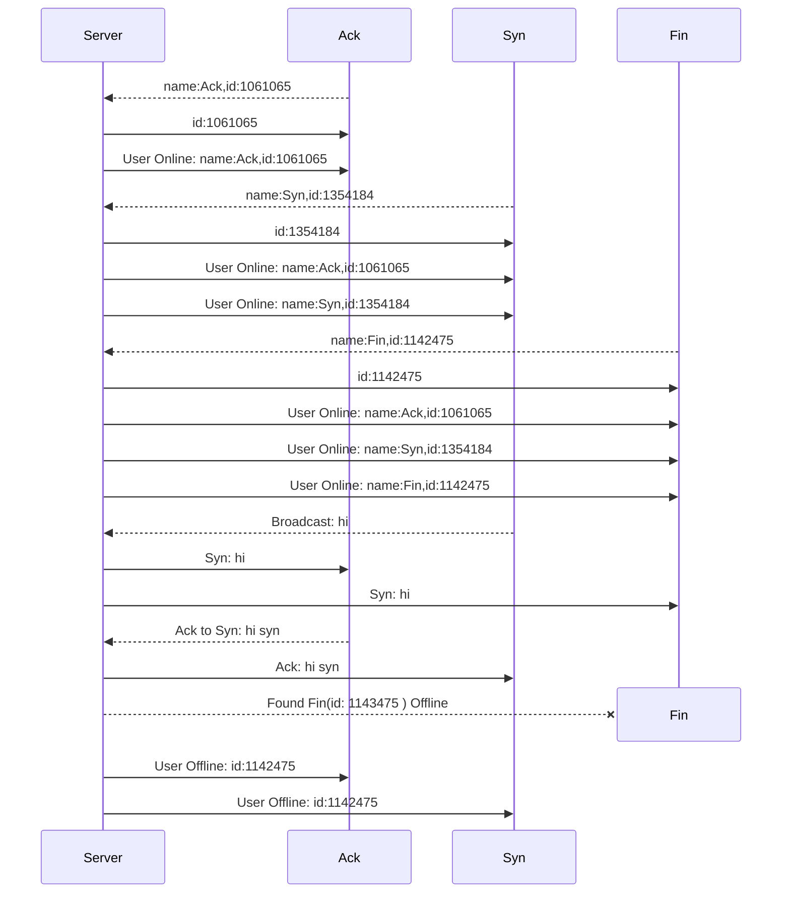

# Centralized Chat Demo
A simplest chat room with literally no synchronization.

## Message Standard

### Package Design

A typical message package in the project is shown like below.

In this project, the server has id 0. The broadcast id is also 0 as well.

**Head:**

| Field | type | size |
| :--: | :--: | :--: |
| Timestamp | uint64 | 8B |
| Sender_id | uint32 | 4B |
| Receiver_id | uint32 | 4B |
| Message_type | uint32 | 4B |
| Message_size | uint32 | 4B |

**Body**:

|    Field     |  type  |         size         |
| :----------: | :----: | :------------------: |
| Message_body | []byte | **<Message_size>** B |

### Message Types

|      Name      |  Id  |                     Description                     |
| :------------: | :--: | :-------------------------------------------------: |
| Normal_Message |  0   |   Normal message type, contains a single message    |
|  Join_Message  |  1   | Sent when joining a chat room, contains id and name |
| Member_Message |  2   | Sent to inform members of other members' name & id  |
| Leave_Message  | 1023 |        Sent to say goodbye to other members         |

## Server & Client Communication Example



## Build

```powershell
#server
go build srv.go
#client
go build clt.go
```
